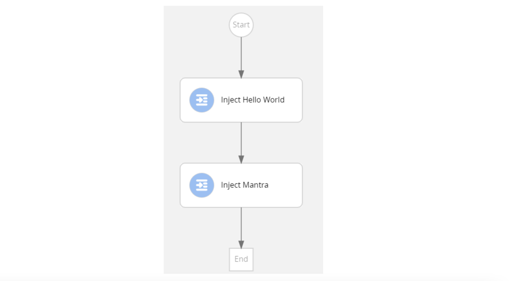
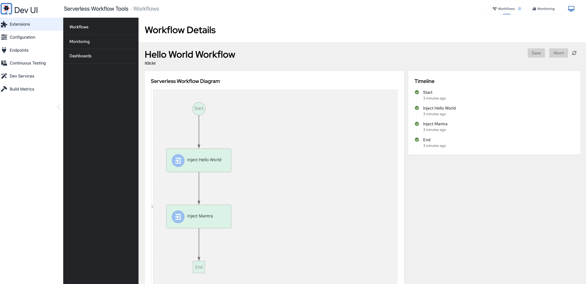
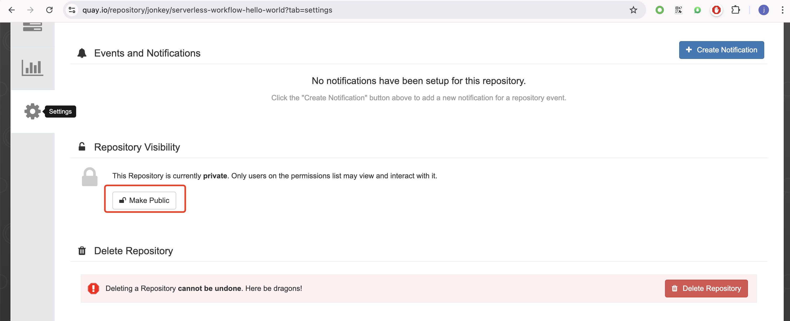
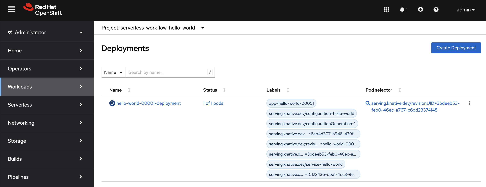
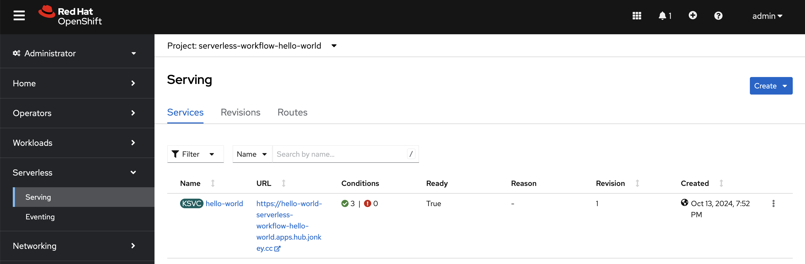

# **serverless-logic-try**

1. ## serverless-workflow-hello-world

   This is the project manully created for serverless workflow for creating steps demostration

   We are going to create a workflow application that serves a `hello_world` endpoint. The workflow contains the following two states:

   - `Inject Hello World`: Injects a `Hello World` message into the response

   - `Inject Mantra`: Injects a `Mantra` message into the response

     

   - To configure the Apache ~~Maven~~ `settings.xml` file and Quarkus extension registry client, follow the instructions in the [Configuring the Maven settings.xml file for the online repository](https://access.redhat.com/documentation/en-us/red_hat_build_of_quarkus/quarkus-2-7/guide/f93c45bd-4feb-4f74-a70a-022e9fb41957#proc_online-maven_quarkus-getting-started) and [Configuring Quarkus extension registry client](https://access.redhat.com/documentation/en-us/red_hat_build_of_quarkus/quarkus-2-7/guide/f93c45bd-4feb-4f74-a70a-022e9fb41957#_9064727c-4b8a-4068-a9ba-8de6b258a14a).
   - Complement the configured Apache Maven `settings.xml` file with the following profile to have access to the OpenShift Serverless Logic repository:

   **Profile to access the OpenShift Serverless Logic repository**

   ```xml
   <!-- Configure the OpenShift Serverless Logic Maven repository -->
   <profile>
     <id>red-hat-ga-maven-repository</id>
     <activation>
       <activeByDefault>true</activeByDefault>
     </activation>
     <repositories>
       <repository>
         <id>red-hat-ga-maven-repository</id>
         <url>https://maven.repository.redhat.com/ga</url>
         <releases>
           <enabled>true</enabled>
         </releases>
         <snapshots>
           <enabled>false</enabled>
         </snapshots>
       </repository>
     </repositories>
     <pluginRepositories>
       <pluginRepository>
         <id>red-hat-ga-maven-repository</id>
         <url>https://maven.repository.redhat.com/ga</url>
         <releases>
           <enabled>true</enabled>
         </releases>
         <snapshots>
           <enabled>false</enabled>
         </snapshots>
       </pluginRepository>
     </pluginRepositories>
   </profile>
   ```

   **Prepare environment**

   docker or podman is needed 

   ```
   docker login registry.redhat.io
   docker login quay.io
   ```

   **Create project**

   ```bash
   kn workflow quarkus create \
    --name serverless-workflow-hello-world \
    --extension quarkus-jsonp,quarkus-smallrye-openapi \
    --quarkus-platform-group-id=com.redhat.quarkus.platform \
    --quarkus-version=3.8.4.redhat-00002
   ```

   **Creating a workflow**

   a workflow had been created at

   ```bash
   serverless-workflow-hello-world/src/main/resources/workflow.sw.json
   ```

   overwrite it as below

   ```json
   {
     "id": "hello_world", 
     "version": "1.0",
     "specVersion": "0.8",
     "name": "Hello World Workflow",
     "description": "JSON based hello world workflow",
     "start": "Inject Hello World", 
     "states": [ 
       {
         "name": "Inject Hello World",
         "type": "inject", 
         "data": { 
           "greeting": "Hello World"
         },
         "transition": "Inject Mantra" 
       },
       {
         "name": "Inject Mantra",
         "type": "inject",
         "data": {
           "mantra": "Serverless Workflow is awesome!" 
         },
         "end": true 
       }
     ]
   }
   ```

   Example workflow data

   ```json
   {
     "greeting": "Hello World",
     "mantra": "Serverless Workflow is awesome!"
   }
   ```

   **Run application locally**

   if your are using Mac arm and you are going to build x86 image, you will need to add below to 

   serverless-workflow-hello-world/src/main/resources/application.properties

   ```shell
   quarkus.docker.buildx.platform=linux/amd64
   ```

   run locally

   ```shell
   cd serverless-workflow-hello-world
   mvn clean quarkus:dev
   ```

   Once your workflow application is started, you can send a request for the provided endpoint:

   Example request

   ```shell
   curl -X POST -H 'Content-Type:application/json' http://localhost:8080/hello_world
   ```

   Example response

   ```shell
   {"id":"efb59bfa-ad9c-4062-a6d2-2d9184dd4b3d","workflowdata":{"greeting":"Hello World","mantra":"Serverless Workflow is awesome!"}}
   ```

   Example log output

   ```shell
   2024-10-13 16:57:29,083 INFO  [org.kie.kog.ser.wor.dev.DevModeServerlessWorkflowLogger] (executor-thread-3) Starting workflow 'hello_world' (92b3d6db-b661-40b1-819a-6010884ec2dd)
   2024-10-13 16:57:29,086 INFO  [org.kie.kog.ser.wor.dev.DevModeServerlessWorkflowLogger] (executor-thread-3) Triggered node 'Start' for process 'hello_world' (92b3d6db-b661-40b1-819a-6010884ec2dd)
   2024-10-13 16:57:29,087 INFO  [org.kie.kog.ser.wor.dev.DevModeServerlessWorkflowLogger] (executor-thread-3) Triggered node 'Inject Hello World' for process 'hello_world' (92b3d6db-b661-40b1-819a-6010884ec2dd)
   2024-10-13 16:57:29,092 INFO  [org.kie.kog.ser.wor.dev.DevModeServerlessWorkflowLogger] (executor-thread-3) Property 'workflowdata.greeting' changed value from: 'null', to: '"Hello World"'
   2024-10-13 16:57:29,092 INFO  [org.kie.kog.ser.wor.dev.DevModeServerlessWorkflowLogger] (executor-thread-3) Triggered node 'Inject Mantra' for process 'hello_world' (92b3d6db-b661-40b1-819a-6010884ec2dd)
   2024-10-13 16:57:29,093 INFO  [org.kie.kog.ser.wor.dev.DevModeServerlessWorkflowLogger] (executor-thread-3) Property 'workflowdata.mantra' changed value from: 'null', to: '"Serverless Workflow is awesome!"'
   2024-10-13 16:57:29,093 INFO  [org.kie.kog.ser.wor.dev.DevModeServerlessWorkflowLogger] (executor-thread-3) Triggered node 'End' for process 'hello_world' (92b3d6db-b661-40b1-819a-6010884ec2dd)
   2024-10-13 16:57:29,094 INFO  [org.kie.kog.ser.wor.dev.DevModeServerlessWorkflowLogger] (executor-thread-3) Workflow 'hello_world' (92b3d6db-b661-40b1-819a-6010884ec2dd) completed
   2024-10-13 16:59:35,230 INFO  [org.kie.kog.qua.wor.dep.dev.DataIndexInMemoryContainer] (docker-java-stream-708208186) STDOUT: 2024-10-13 08:59:35,220 INFO  [io.zon.tes.db.pos.emb.EmbeddedPostgres] (postgres:pid(96)) 2024-10-13 08:59:35.218 UTC [100] LOG:  checkpoint starting: time
   ```

   The SwaggerUI is available at `localhost:8080/q/swagger-ui/` when you run the application

   

   To stop the application, press `CTRL+C`.

   **Build and push application image**

   added below to serverless-workflow-hello-world/src/main/resources/application.properties

   ```
   quarkus.oidc.tenant-enabled=false
   ```

   run image build

   ```shell
   kn workflow quarkus build --image quay.io/jonkey/serverless-workflow-hello-world:1.0
   ```

   example output

   ```shell
   [INFO] [io.quarkus.container.image.docker.deployment.DockerProcessor] Built container image quay.io/jonkey/serverless-workflow-hello-world:1.0
   
   [INFO] [io.quarkus.deployment.QuarkusAugmentor] Quarkus augmentation completed in 20383ms
   [INFO] ------------------------------------------------------------------------
   [INFO] BUILD SUCCESS
   [INFO] ------------------------------------------------------------------------
   [INFO] Total time:  24.870 s
   [INFO] Finished at: 2024-10-13T19:38:33+08:00
   [INFO] ------------------------------------------------------------------------
   Created a local image: quay.io/jonkey/serverless-workflow-hello-world:1.0
   ✅ Build success
   ✅ Quarkus SonataFlow project successfully buil
   ```

   push to quay.io

   ```
   docker push quay.io/jonkey/serverless-workflow-hello-world:1.0
   ```

   example output

   ```
   The push refers to repository [quay.io/jonkey/serverless-workflow-hello-world]
   33fece2d9f4b: Pushed
   4283b9ddba7b: Pushed
   2a40ea2598ca: Pushed
   fce09bf990cd: Pushed
   3ca81a22c6d1: Pushed
   1053d00b8e29: Pushed
   1.0: digest: sha256:13f21c36ef9cef86ab968efb95a2b50209a93fa4cf78a27b67cb28c4689c0e3c size: 1582
   ```

   changed image repository to public

   

   **Deploy appliation**

   Create a new project 

   ```
   oc new-project serverless-workflow-hello-world
   ```

   deploy

   ```
   kn service create hello-world \
       --image=quay.io/jonkey/serverless-workflow-hello-world:1.0 \
       --pull-policy=IfNotPresent \
       --port 8080
   ```

   Verify from OpenShift console

   Deployment

   

   Serving

   

   Get entry url from CLI

   ```
   kn service list hello-world
   ```

   example output

   ```
   NAME          URL                                                                      LATEST              AGE     CONDITIONS   READY   REASON
   hello-world   https://hello-world-serverless-workflow-hello-world.apps.hub.jonkey.cc   hello-world-00001   5m31s   3 OK / 3     True
   ```

   Use the URL in the output to send request to your workflow application.

   Example request

   ```shell
   curl -X POST -k -H 'Content-Type:application/json' https://hello-world-serverless-workflow-hello-world.apps.hub.jonkey.cc/hello_world
   ```

   Example response

   ```json
   {"id":"48a2acd0-46ee-4b2b-9eee-ab014fd3d976","workflowdata":{"greeting":"Hello World","mantra":"Serverless Workflow is awesome!"}}%
   ```

2. ## serverless-workflow-functions-quarkus

3. ## serverless-workflow-functions-events-quarkus

